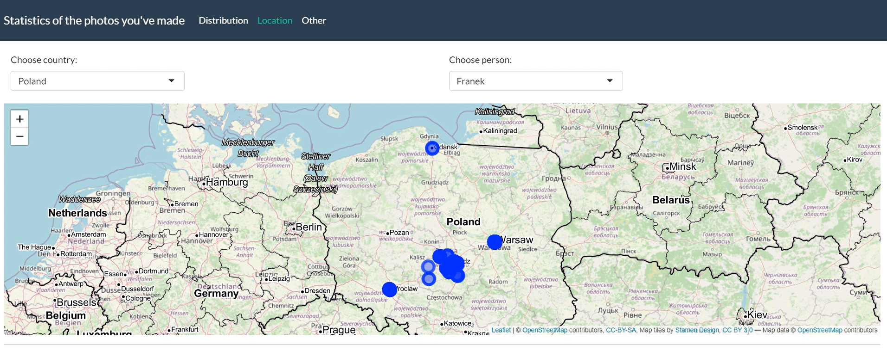
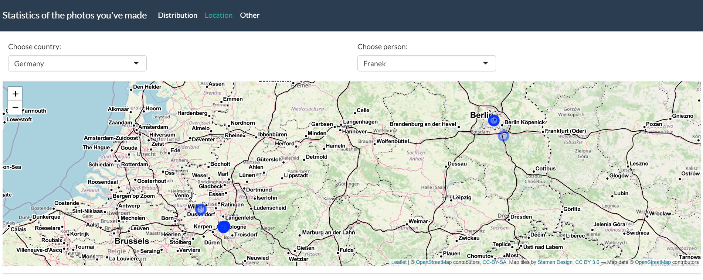
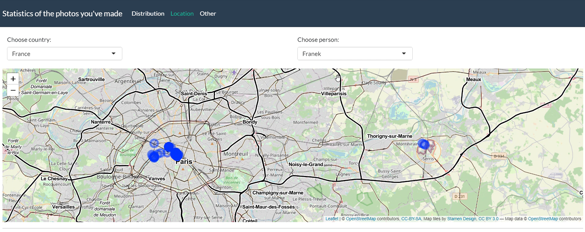

# Rstudio-projects
W tym repozytorium znajdują się projekty wykonane w Rstudio. 
## Projekt 1 - R_languages
Wykonane zadanie polegało na odworzeniu kilku zapytań za pomocą różnych języków dostępnych w pakietach Rstudio. 
Były to:
- sqldf
- zapytania bazowe R
- dplyr
- data.table

  Następnie czas zapytań i ich wydajność zostały zmierzone za pomocą wywołania microbenchmark.

## Projekt 2 - Bike_data_analysys
Celem tego projektu było zbadanie danych na temat jazdy wypożyczonymi rowerami przez mieszkańców Nowego Jorku i New Jersey.
Przeanalizowane zostały min. grupy wiekowe, subskrybenci oraz stacje rowerowe. Wyniki zostały zamieszczone w raporcie na wykresach.  

## Projekt 3 - Shiny
W projekcie znajdują się moja część projektu 3-osobowego dotyczącego stworzenia aplikacji Shiny, która w interaktywny sposób pozwala na wyświetlanie wyników. Temat dotyczył wyciągania metadanych ze zrobionych przez moich znajomych zdjęć, które zostały wykorzystane do stworzenia interaktywnej mapy, której fragmenty można zobaczyć poniżej. Metadane zostały wyciągnięte za pomocą kodu w pythonie. 

